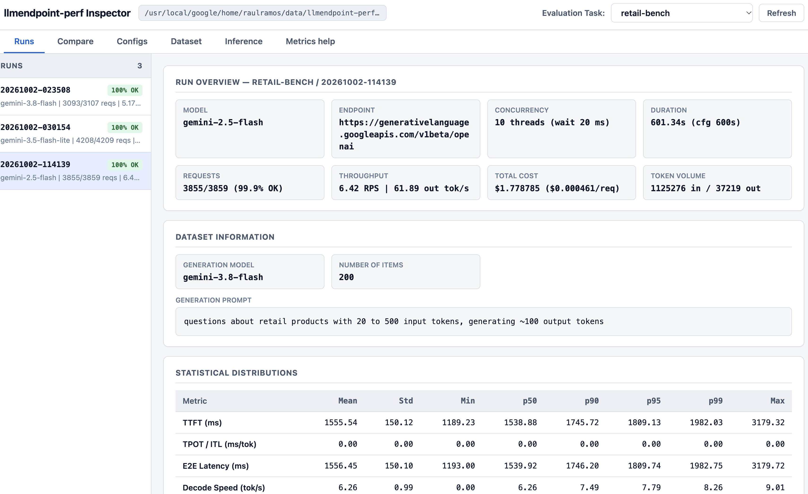

# `llmendpoint-perf`

Technical and cost performance benchmarking framework for **OpenAI-compatible** LLM endpoints.

`llmendpoint-perf` generates synthetic text and multimodal (text + image) benchmark datasets, runs multi-threaded streaming load tests against `/v1/chat/completions` endpoints, records granular per-request latency and token telemetry, and provides both CLI and interactive Web UI tools to inspect and compare runs.





---

## Installation

```bash
pip install -e .
```

---

## Quick Start

1. **Set the storage base path** for evaluation tasks (supports a local directory or a Google Cloud Storage `gs://bucket/prefix` URI) and your endpoint API key:
   ```bash
   export LLMENDPOINTPERF_BASEPATH="./tasks"
   export OPENAI_API_KEY="your-api-key"
   ```

2. **Initialize an evaluation task** using a configuration file (see [`examples/config_text.yaml`](examples/config_text.yaml), [`examples/config_multimodal.yaml`](examples/config_multimodal.yaml), and the full [Configuration Reference](docs/config_options.md)):
   ```bash
   llmendpoint-perf init retail-bench --config examples/config_text.yaml
   ```

   This will copy whatever config file you pass to the tasks directory under $LLMENDPOINTPERF_BASEPATH/retail-bench/config.yaml`. This will allow to change params (model, costs, etc.) between evaluation runs.

3. **Generate the synthetic evaluation dataset** (`prompts.jsonl`):
   ```bash
   llmendpoint-perf generate_dataset retail-bench --overwrite
   ```

   The dataset is generated using the `dataset.generation_prompt` field in `config.yaml`. This will allow you to generate a dataset of prompts that are similar to the one provided, but with some variations.


4. **Run a benchmark experiment**:
   ```bash
   llmendpoint-perf run retail-bench
   ```

5. **Inspect or compare runs via CLI or Web UI**:
   ```bash
   llmendpoint-perf inspect retail-bench
   llmendpoint-perf compare retail-bench:20261001-221500 retail-bench:20261001-223000
   llmendpoint-perf ui
   ```

---

## 1. How Synthetic Datasets Are Generated

Evaluation datasets are configured under the `dataset:` section of `config.yaml` and generated via:

```bash
llmendpoint-perf generate_dataset <task-name> [--overwrite] [--base-path <path>]
```

### Diversity-Preserving Prompt Generation
To generate `num_items` distinct evaluation prompts without mode collapse or repetitive phrasing:
1. **Prompt Wrapping & Variation Injection**: Each item request wraps your `dataset.generation_prompt` in a structured generator prompt injected with a unique item index, a random entropy seed, a randomized user persona (e.g., technical buyer, enterprise analyst, skeptical reviewer), and a randomized structural style (e.g., comparative evaluation, scenario-based troubleshooting, multi-part inquiry).
2. **Dynamic Input Token Length Targeting**: If `generation_prompt` mentions an input token range (such as `"20 to 500 input tokens"`), `llmendpoint-perf` uniformly samples a specific target length for each individual item so the resulting dataset spans the full requested token distribution.
3. **Concurrent Generation**: Requests to `generation_model_endpoint` (`generation_model`) are executed in parallel using `dataset.num_threads` worker threads with automatic retries on transient failures. All generation progress is logged to `$LLMENDPOINTPERF_BASEPATH/<task-name>/dataset-generation.log`.

### Text-Only vs. Multimodal Datasets
Generated prompts are written to `$LLMENDPOINTPERF_BASEPATH/<task-name>/prompts.jsonl`, where each line is a JSON object containing an OpenAI-compatible `messages` array:

* **Text-Only Mode (`dataset.multimodal.enabled: false`)**:
  ```json
  {"messages": [{"role": "user", "content": "What are the warranty terms and return eligibility for..."}]}
  ```
* **Multimodal Mode (`dataset.multimodal.enabled: true`)**:
  Each generated text question is paired with a base64-encoded image (`data:image/jpeg;base64,...` or `png`):
  ```json
  {"messages": [{"role": "user", "content": [{"type": "text", "text": "..."}, {"type": "image_url", "image_url": {"url": "data:image/jpeg;base64,..."}}]}]}
  ```
  Multimodal images can be sourced in three ways via `dataset.multimodal.image_source`:
  * `"google_search"` *(default when not specified or when the user is not precise about how to generate images)*: For each dataset item, instructs the generator model to create an aligned `(image_search_query, prompt)` pair, searches Google Images for `image_search_query`, downloads and validates a matching real-world image, resizes it to `image_width` × `image_height`, and encodes it as base64.
  * `"synthetic"`: Programmatically renders deterministic test images (charts, product cards, geometric patterns) at the exact configured resolution (`image_width` × `image_height`) and format (`jpeg` or `png`) to benchmark vision token encoding and payload transfer overhead.
  * **Local directory or `gs://bucket/prefix`**: Samples real `.jpg`, `.png`, or `.webp` images from the specified path, resizes them to `image_width` × `image_height`, and encodes them as base64 data URIs.

---

## 2. How to Run Experiments

Benchmark parameters are defined under the `evaluation:` section of `config.yaml` and executed via:

```bash
llmendpoint-perf run <task-name> [options]
```

### Execution Workflow
1. **Configuration Snapshot**: Reads `config.yaml` and `prompts.jsonl` from `$LLMENDPOINTPERF_BASEPATH/<task-name>/`, applies any CLI overrides, creates an isolated run directory `runs/YYYYMMDD-HHMMSS/` (UTC timestamp), and writes an immutable snapshot of the effective `config.yaml`.
2. **Optional Warmup Phase**: If `evaluation.warmup_requests > 0`, dispatches warmup requests first to prime HTTP connection pools and endpoint caches. Warmup calls are excluded from benchmark metrics.
3. **Rate-Controlled Multi-Threaded Streaming**:
   * Spawns `evaluation.num_threads` concurrent worker threads.
   * Paces request dispatches across threads using `evaluation.wait_time_between_requests_ms`.
   * Sends streaming chat completion requests (`stream: true`, `stream_options: {"include_usage": true}`) cycling through `prompts.jsonl` (`round_robin` or `random`) until `evaluation.run_time_secs` elapses (or `evaluation.max_requests` is reached).
   * Measures **TTFT** (Time to First Token), **TPOT / ITL** (Time Per Output Token), **E2E Latency**, **Decode Speed** (`output_tokens_per_sec`), token counts (`input_tokens`, `output_tokens`, `reasoning_tokens`, `cached_input_tokens`), **SLO Goodput**, and **Request Cost** (`cost_usd`).

### Running Parameter Sweeps with `--config-override` (`-o`)
You can run multiple experiments under the same evaluation task without editing `config.yaml` by passing dot-notation overrides on the command line:

```bash
# Baseline run (10 threads)
llmendpoint-perf run retail-bench --run-id baseline-10t

# High-concurrency run (30 threads, shorter inter-request wait)
llmendpoint-perf run retail-bench \
  -o evaluation.num_threads=30 \
  -o evaluation.wait_time_between_requests_ms=5 \
  --run-id high-load-30t

# Evaluate an alternative model on the exact same dataset
llmendpoint-perf run retail-bench \
  -o evaluation.model=gemini-2.5-pro \
  --run-id gemini-2.5-pro-10t
```

### Storage & Run Artifacts Layout
All artifacts for a task are stored under `$LLMENDPOINTPERF_BASEPATH/<task-name>/`:

```text
$LLMENDPOINTPERF_BASEPATH/<task-name>/
├── config.yaml                          # Task configuration file
├── dataset-generation.log               # Log of synthetic dataset generation
├── prompts.jsonl                        # Generated evaluation prompts
└── runs/
    └── YYYYMMDD-HHMMSS/                 # Dedicated folder per benchmark run
        ├── config.yaml                  # Snapshot of config.yaml used for this run
        ├── results.jsonl                # Aggregated metrics, throughput, cost & percentiles
        ├── calls.jsonl                  # Per-request telemetry, token usage & raw responses
        └── log.txt                      # Execution log (mirrors stdout)
```

### Inspecting and Comparing Runs from the CLI
* **List all runs for a task**:
  ```bash
  llmendpoint-perf inspect retail-bench --list-runs
  ```
* **Inspect a single run** (defaults to the latest run if `--run-id` is omitted):
  ```bash
  llmendpoint-perf inspect retail-bench --run-id baseline-10t
  ```
* **Compare multiple runs or tasks side-by-side** (shows dataset info, throughput, cost, and `Mean`/`p50`/`p95`/`p99` distributions for `TTFT`, `TPOT`, `E2E Latency`, `Decode Speed`, `Input Tokens`, and `Output Tokens`; see the full [Metrics Reference](docs/metrics.md)):
  ```bash
  llmendpoint-perf compare retail-bench:baseline-10t retail-bench:high-load-30t
  ```

---

## 3. How to Run and Use the Web UI

`llmendpoint-perf` includes an interactive Web UI for browsing tasks, comparing runs, inspecting datasets (including multimodal images), and drilling into individual inference calls.

### Starting the UI Server
Ensure `LLMENDPOINTPERF_BASEPATH` is exported in your environment (if `LLMENDPOINTPERF_BASEPATH` is not set and `--base-path` is not provided, the server will report an error and exit):

```bash
export LLMENDPOINTPERF_BASEPATH="./tasks"
llmendpoint-perf ui --host 127.0.0.1 --port 8080
```

Then open `http://127.0.0.1:8080` in your browser.

### Navigating the UI
* **Top Header & Task Selector**:
  * Displays the active `LLMENDPOINTPERF_BASEPATH` and provides an **Evaluation Task selector dropdown** on the top right to switch between any evaluation task stored under `LLMENDPOINTPERF_BASEPATH`, along with a **Refresh** button to reload newly completed runs.
* **Tabs**:
  1. **Runs** *(2 panels)*:
     * **Left panel**: Lists all runs for the selected evaluation task with quick status badges.
     * **Right panel**: Displays the full `inspect` report for the selected run, including Run Overview cards, Dataset Information (`Generation Model`, `Number of Items`, `Generation Prompt`), Statistical Percentile Distributions (`Mean`, `Std`, `Min`, `p50`, `p90`, `p95`, `p99`, `Max`), and the raw CLI report.
  2. **Compare** *(full width)*:
     * Renders a side-by-side comparison table across all runs of the selected task (covering throughput, SLO goodput, `TTFT`, `TPOT`, `E2E Latency`, `Decode Speed`, `Input Tokens`, `Output Tokens`, and cost efficiency), alongside the Dataset Information for each run.
  3. **Configs** *(2 panels)*:
     * **Left panel**: Lists all runs for the selected task.
     * **Right panel**: Displays the immutable `runs/<run-id>/config.yaml` snapshot used for that run.
  4. **Dataset** *(2 panels)*:
     * **Left panel**: Scrollable index of all prompt items (`#0`, `#1`, …) in `prompts.jsonl`, badged with `IMAGE` when an item contains multimodal image inputs.
     * **Right panel**: Displays the dataset generation metadata and renders the selected item's `messages`—including inline image rendering for base64 multimodal prompts.
  5. **Inference** *(3 panels)*:
     * **Left panel**: Lists the runs of the selected task.
     * **Center panel**: Lists every individual inference request recorded in `runs/<run-id>/calls.jsonl` for the selected run (showing call index, prompt index, HTTP status badge, TTFT, E2E latency, and input/output token counts).
     * **Right panel**: Displays complete details for the selected inference call, including all timing/token/cost telemetry fields, the rendered **Input Prompt** (with inline multimodal images), the rendered **Model Output** (with text and multimodal image support), and the raw JSON record.
  6. **Metrics help** *(full width)*:
     * Interactive reference guide explaining the streaming measurement timeline (`t_start`, `t_first_token`, `t_last_token`, `t_end`), all per-request and aggregated metrics, statistical percentiles, SLO goodput, and cost formulas (matching [`docs/metrics.md`](docs/metrics.md)).

